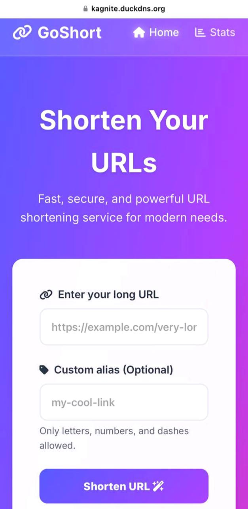

# 🚀 GoShort - Cloud-Native URL Shortener


**GoShort** is a production-ready, full-stack URL shortening service
built with a modern **microservices architecture**. It leverages Golang
for high-performance backend logic, Redis for caching, PostgreSQL for
storage, and Vue.js 3 for a sleek glassmorphism frontend.

------------------------------------------------------------------------

## ✨ Features

-   ⚡ **High Performance:** Go backend + Redis caching for extremely
    fast redirects.
-   🎨 **Modern UI:** Glassmorphism design built with Vue.js 3 and Vite.
-   🛡️ **Secure:** Includes domain allowlist, SSRF protection, and
    secure headers.
-   🐳 **Dockerized:** Fully containerized using Docker Compose.
-   🔄 **Blue/Green Deployment:** Zero-downtime backend releases.
-   🌐 **Nginx Gateway:** Reverse proxy for routing and static asset
    delivery.
-   📊 **Analytics Ready:** Schema allows tracking clicks and user
    agents.

------------------------------------------------------------------------

## 🛠️ Tech Stack

  ------------------------------------------------------------------------
  Component      Technology     Description
  -------------- -------------- ------------------------------------------
  Frontend       Vue.js 3       SPA, Vite, Axios

  Backend        Go (Golang)    Chi Router, Clean Architecture

  Database       PostgreSQL 15  ACID-compliant URL storage

  Cache          Redis 7        Hot data caching, rate limiting

  Gateway        Nginx          Reverse proxy

  DevOps         Docker Compose Multi-stage builds, microservices
                                orchestration
  ------------------------------------------------------------------------

------------------------------------------------------------------------

## 🏗️ Architecture Overview

The system includes the following services:

1.  **Nginx** --- Entry point, reverse proxy, static asset handler\
2.  **Frontend** --- Vue.js SPA\
3.  **Backend (Blue/Green)** --- Go API running dual services\
4.  **PostgreSQL** --- Persistent database\
5.  **Redis** --- Fast in-memory cache

------------------------------------------------------------------------

## 🚀 Getting Started

### Prerequisites

-   Docker & Docker Compose
-   Git

------------------------------------------------------------------------

### 1. Clone the Repository

``` bash
git clone https://github.com/Kagnite/GoShort.git
cd GoShort
```

------------------------------------------------------------------------

### 2. Configure Environment

Modify `docker-compose.prod.yml` or export your environment variables
manually.

Production requires secure values.

------------------------------------------------------------------------

### 3. Run the Services with Docker Compose

``` bash
# Secrets (required in production)
export DB_PASSWORD='your_secure_password'
export REDIS_PASSWORD='your_secure_password'

# Disable allowlist for testing
export SECURITY_USE_ALLOWLIST=false

# Start all services
docker compose -f docker-compose.prod.yml up -d
```

------------------------------------------------------------------------

## 4. Access the Application

### Frontend

    http://localhost:8081
    http://<server-ip-or-domain>:8081

### API Health Check

    http://localhost:8081/api/v1/health
    http://<server-ip-or-domain>:8081/api/v1/health

------------------------------------------------------------------------

## 🔧 Configuration Variables

  -------------------------------------------------------------------------------------
  Variable                   Description                       Default
  -------------------------- --------------------------------- ------------------------
  `DB_PASSWORD`              PostgreSQL Password               Required

  `REDIS_PASSWORD`           Redis Password                    Required

  `SECURITY_USE_ALLOWLIST`   Enable/Disable domain restriction true

  `ALLOWED_DOMAINS`          Comma-separated list of allowed   kagnite.duckdns.org
                             domains                           

  `BASE_URL`                 Base URL for generated short      https://yourdomain.com
                             links                             
  -------------------------------------------------------------------------------------

------------------------------------------------------------------------

## 🗄️ Database Schema

``` sql
CREATE TABLE urls (
    id VARCHAR(36) PRIMARY KEY,
    original_url TEXT NOT NULL,
    short_code VARCHAR(50) UNIQUE NOT NULL,
    click_count BIGINT DEFAULT 0,
    created_at TIMESTAMP DEFAULT CURRENT_TIMESTAMP
);
```

------------------------------------------------------------------------

## 🤝 Contributing

Contributions are welcome! Please feel free to submit a Pull Request.

### Steps

1.  **Fork the Project**

2.  **Create your Feature Branch**

    ``` bash
    git checkout -b feature/AmazingFeature
    ```

3.  **Commit your Changes**

    ``` bash
    git commit -m "Add AmazingFeature"
    ```

4.  **Push to the Branch**

    ``` bash
    git push origin feature/AmazingFeature
    ```

5.  **Open a Pull Request**

------------------------------------------------------------------------

# 📝 Pull Request Template

## 📌 Description

Provide a clear explanation of the changes and why they are needed.

------------------------------------------------------------------------

## ✅ Type of Change

-   [ ] Feature\
-   [ ] Bug Fix\
-   [ ] Breaking Change\
-   [ ] Refactor\
-   [ ] Documentation Update\
-   [ ] Performance Improvement\
-   [ ] Other

------------------------------------------------------------------------

## 🔍 Related Issues

    Closes #ISSUE_NUMBER

------------------------------------------------------------------------

## 🧪 Testing Checklist

-   [ ] Unit Tests\
-   [ ] Integration Tests\
-   [ ] Manual Testing

------------------------------------------------------------------------

## 📸 Screenshots 

<div align="center">
  
  <br/><br/>
  
</div>

---

------------------------------------------------------------------------

## 📦 Deployment Notes

------------------------------------------------------------------------

## ⚠️ Checklist

-   [ ] Follows project coding style\
-   [ ] Self-review done\
-   [ ] Comments added\
-   [ ] Tests added or updated\
-   [ ] All tests pass

------------------------------------------------------------------------

## 📄 License

Distributed under the MIT License. See the `LICENSE` file for details.
